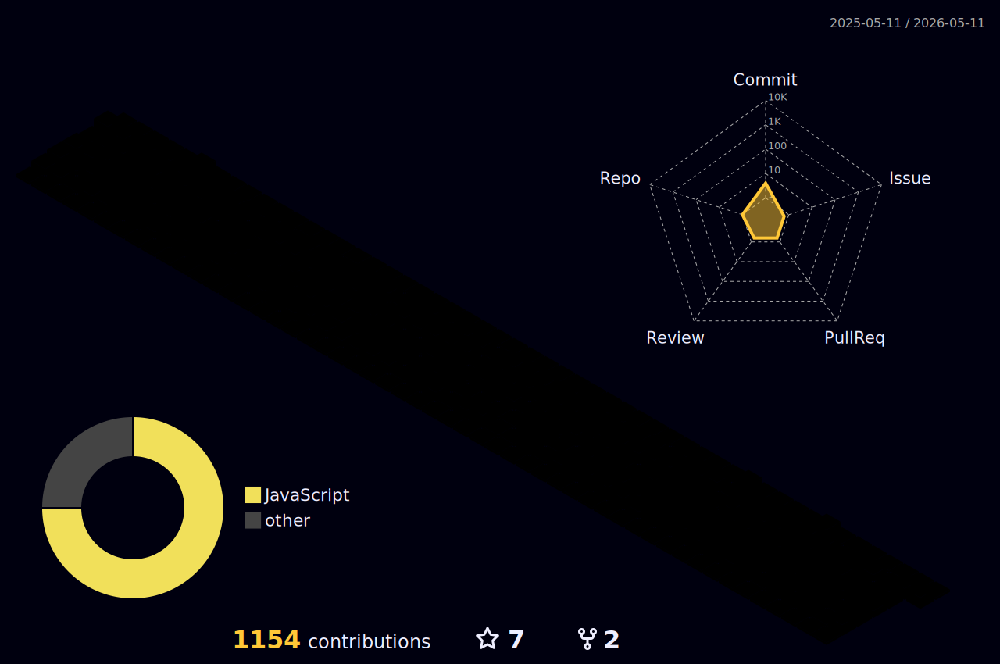

# Hi! I'm Wagner!

Developer with 3 years of experience in the React JS and JavaScript ecosystem, specialized in building and maintaining tested and scalable codebases. Solid expertise in developing and enhancing Design Systems, Product Libraries, and integrating with APIs and Backend for Frontend architectures. Passionate about end-to-end solutions, with the ability to collaborate across various stages of the development cycle, ensuring performance, scalability, and usability. Before transitioning to a tech career, I spent 10 years teaching Yoga and training instructors. Additionally, I managed and provided delivery services on bike in a courier collective.

    I'm on a Bachelor's degree in Computer Science. This is my lab for the following stacks:
  
   

- - -

I also have a technical degree in Electronics, therefore I have a crush on low-level and bricolage stuff. 

I like running and riding my fixie bike, and I had some years working on deliveries too.

Let's grab a coffee and talk a bit about Front-end Development, IoT Projects on Raspberry Pi and more.

<!--
## How to reach me :dart:
[Beacons](https://beacons.ai/wagnetto)

-->

 

<!--

-->

### Thanks for visiting! ☕
