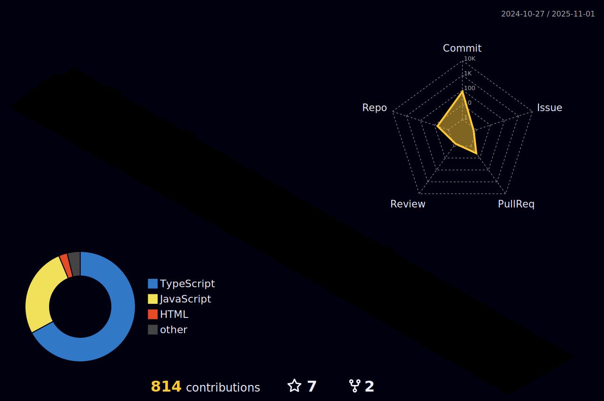

# Hi! I'm Wagner!

Front-end Developer focused on React, with 2+ years of experience in building and maintaining web applications. Skilled in enhancing user interfaces and optimizing development experience, by creating Design System based reusable components to monorepos, and integrating Web views into native apps through middleware environments using Next.js. I'm enthusiastic about quality code delivery, focused on tested code, and monitoring frameworks that ensure scalable solutions. Currently expanding skills in Node.js for a Full stack development approach.

    I'm on a Bachelor's degree in Computer Science. This is my lab for the following stacks:
  
   

- - -

I also have a technical degree in Electronics, therefore I have a crush on low-level and bricolage stuff. 

I like running and riding my fixie bike, and I had some years working on deliveries too.

Let's grab a coffee and talk a bit about Front-end Development, IoT Projects on Raspberry Pi and more.

<!--
## How to reach me :dart:
[Beacons](https://beacons.ai/wagnetto)

-->

 

### Thanks for visiting! ☕
